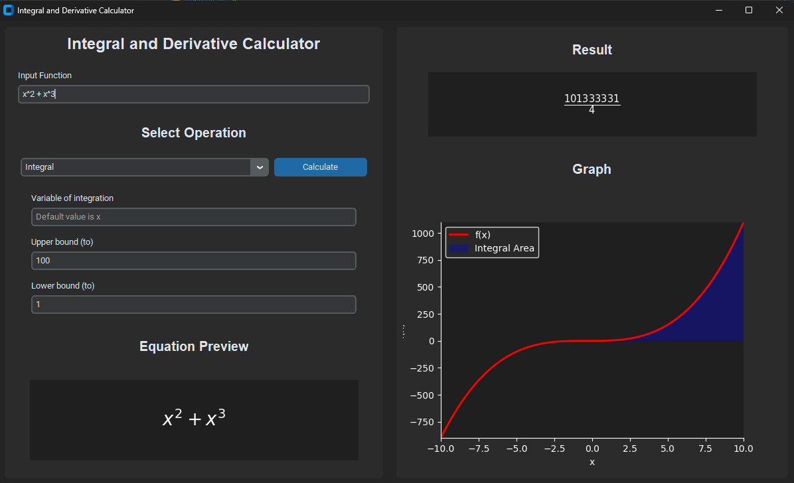

# PyCalculus 🧮📈

*A Python Scientific and Graphing Calculator for Integrals and Derivatives*

## Overview

**PyCalculus** is a fast, intuitive, and user-friendly Python-based scientific calculator that specializes in **calculus operations** — particularly **derivatives** and **integrals**. Built using `Tkinter` for the GUI, `NumPy` for numerical computations, and `Matplotlib` for real-time graphing, PyCalculus offers a powerful visual and computational tool for students, educators, and math enthusiasts.

## ✨ Features

* 🔢 **Symbolic and Numerical Calculations**
   * Calculate **derivatives** (first and higher-order)
   * Evaluate **indefinite** and **definite integrals**
* 📊 **Graphing Capabilities**
   * Visualize **functions**, **derivatives**, and **area under the curve** (integrals)
   * Toggle between function views and calculus visualizations seamlessly
* ⚡ **Performance-Oriented**
   * Utilizes optimized numerical libraries like **NumPy** for fast and reliable computation
* 🖥️ **Intuitive GUI**
   * Clean and responsive interface built with **Tkinter**
   * Easy input and interactive graph plotting with minimal setup

## 🚀 Installation

```bash
git clone https://github.com/yourusername/pycalculus.git
cd pycalculus
pip install -r requirements.txt
python main.py
```

## Requirements

* Python 3.8+
* NumPy
* Matplotlib
* Tkinter (usually bundled with Python)

## 🧪 Example Capabilities

* Calculate:
   * `d/dx (x^2 + 3x)` → shows symbolic and numeric output
   * `∫ x^2 dx` → plots area under curve, provides indefinite integral
   * `∫₀¹ x^2 dx` → computes and displays definite integral result and shaded region on graph
* Visualize:
   * Tangent slope at specific points
   * Instantaneous rate of change
   * Accumulated area with adjustable bounds

## 📸 Screenshots 


## 📚 Educational Use

PyCalculus is designed to help:
* Learn how derivatives and integrals work through **visual feedback**
* Understand calculus concepts beyond just numbers
* Serve as a teaching tool in classrooms or tutoring sessions

## 🛠️ Future Plans

* Support for multivariable functions
* Export graphs as images
* History and session saving
* Light/dark mode for the GUI

## 📄 License

MIT License

## 🤝 Contributing

Pull requests and suggestions are welcome! If you find a bug or have a feature request, feel free to open an issue.